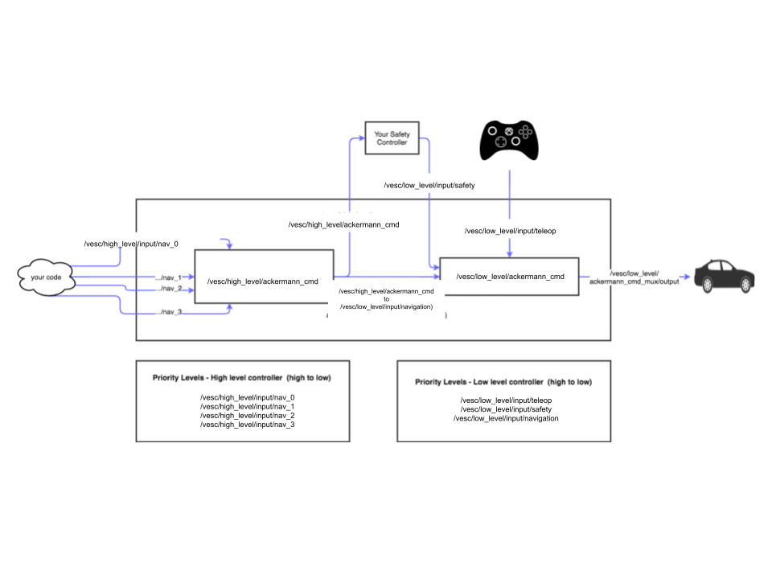

# Lab 3: Wall-Following on the Racecar

| Deliverable                                                                                      | Due Date                             |
|--------------------------------------------------------------------------------------------------|--------------------------------------|
| Briefing Slides (uploaded to your team's [github pages](https://github.com/mit-rss/website2022)) | Monday, March 10th at 1:00PM EST     |
| Briefing (8 min presentation + 3 min Q&A)                                                        | Monday, March 10th during Lab Hours  |
| Pushed code to Git                                                                               | Monday, March 10th at 11:59PM EST    |
| TA Checkoff                                                                                      | Wednesday, March 12th at 11:59PM EST |
| Report (2500 word limit*) (on [team github pages](https://github.com/mit-rss/website2022)) + [Team Member Assessment](https://forms.gle/1nrN7NqX2WTLV7T28)    | Friday, March 14th at 11:59PM EST    |

***There will be a 30% penalty applied for exceeding the word limit.**

## [Link to Slides](https://docs.google.com/presentation/d/1aqZZFYzDALwZ8ZjYHXSnnIJKFKEttZsr/edit#slide=id.p8)

## Quick Links
- [Submission and Grading](#submission-and-grading)
- [Muxes](#muxes)
- [Hardware Setup](#using-the-racecar)
- [Software Setup](#ssh)
- [Troubleshooting + FAQ](#troubleshooting--faq)

## Introduction

It's time to use the actual racecar!
In this lab you will be improving on the wall following code that you ran in simulation and running it on the car.
You will also be building a safety controller to prevent your racecar from crashing into obstacles. You will also meet your teammates for the rest of the semester!

### Racecars
Your team will be assigned a racecar to take care of during the semester.  These cars are expensive so please coordinate with your team to ensure that someone is always responsible for it and avoid leaving it unattended on campus.

### Safety

The racecar platform is exciting and fast, but it is not a toy.
The hardware we have on board
[is](https://www.amazon.com/Waveshare-Jetson-Development-Embedded-Systems/dp/B0C1GFNB13/ref=sr_1_3?crid=1F85WOI96DE36&dib=eyJ2IjoiMSJ9.ts-Dij8a6d4dc4CyEGBqhEsxI5LFDAX1JjHAZXqTmbueaG7Xb-tKZYcmd9dk7bbP7rs51otZhw0cRf84_p7Lp-_pPhq0ZAPWzK-CI7umChTX_56CsXDbM-vnHEYAAvUDV1AF6KZQYYGuSFvmI-fAlTk5NuXzbY-y-qfOyCs-irEIj9c5inGCvFZAZ23cpA3g7D3rq2x9TXCYZz4I-_f64d7ilE1fOwSi_r8p9nHWK-zX_cATt04jKeLeGt1KHMXf7QfBuP63W8IgKdGTJtdb6NljCHVxd9WRcinmDJdIWjay76mddP7jMhQOzjn1os_QAehX25bd3eLzyoShegTxC_KhlJ8cd7edURDdfcFqn1M.1JqWiI6kvD2H_77qFw5qP9lfJ7hMXuJQz_5h8hpBl6g&dib_tag=se&keywords=jetson+orin&qid=1740515045&s=electronics&sprefix=jetson+orin%2Celectronics%2C120&sr=1-3)
[extremely](https://www.spar3d.com/news/lidar/velodyne-cuts-vlp-16-lidar-price-4k/)
[expensive](https://www.robotshop.com/en/hokuyo-ust-10lx-scanning-laser-rangefinder.html?gclid=Cj0KCQiAq6_UBRCEARIsAHyrgUxYmgjfz734t-zWCqa2U4l7LAVsZ1_cp2CuvuD3WalcBQ9tCp2_WmMaAjbAEALw_wcB),
and it is your responsibility to keep it in good condition for future classes.
The racecar can survive a couple light bumps, but if it goes flying into a wall it can be destroyed. The whole frame can split in half, the lidar can get scratched, the board can get damaged, etc. Any one of these repairs can cost hundreds, if not thousands of dollars, in addition to the dozens of hours your lovely TAs put into assembling and testing them.

If your car develops hardware issues for any reason, please tell the TAs immediately and we will do our best to repair it. Most teams will probably have some sort of hardware issue throughout the course, and it is typically not a big deal.
However, if you damage the car in an extreme way through obviously reckless behaviour, you may find yourself working on the simulated car for the rest of the course.


### Electrical Safety

The racecar runs on relatively low voltage ([≤ 20V](https://www.amazon.com/Energizer-XP18000-Universal-External-Netbooks/dp/B002K8M9HC)) so we are not too concerned about dangerous shocks.
But as with any electrical system, it is always important to take proper safety precautions.
For example, ground yourself before touching any of the exposed circuit boards like the jetson.

Please have all members of your team read and sign the electrical safety form here before starting work on the racecar:
[https://eecs-ug.scripts.mit.edu:444/safety/index.py/6.141](https://eecs-ug.scripts.mit.edu:444/safety/index.py/6.4200)

The XT computer batteries are LiPO batteries, which can be dangerous if not treated properly. We will provide storage bags for you to store them safely in between work sessions. See this [video](https://www.youtube.com/watch?v=aZOKLpOn_W4) for an example of a LiPo battery fire. And please review [these notes](https://ehs.mit.edu/wp-content/uploads/2019/09/Lithium_Battery_Checklist.pdf) for how to operate them safely.

## Submission and Grading

From now on, for each lab, your tasks may include:
* publishing a report on your team's github pages website
* giving an 8 minute briefing presentation (plus 3 minutes Q&A) together with your team
* uploading the briefing slides to your github pages website
* submitting a team member assessment form
* completing a check off with your team's assigned TA

See the deliverables chart at the top of this page for due dates and times.

If you haven't already done so, follow the instructions for your team's [github pages website](https://github.com/mit-rss/website2022), which will be hosting your lab reports. As part of this you will need to create an organization for your team on github.com (not MIT's Github enterprise) called rss2025-[TEAM_NUMBER] and make sure all of your code is pushed there by the lab report deadline. At this time, the TAs will pull your team's report from your website. Please ensure that the report is complete and that you have linked to your presentation. Your team organization is also where you should push all of your lab code.

You can view the rubrics for the [lab report](https://canvas.mit.edu/courses/31106/assignments/393140) and the [briefing](https://canvas.mit.edu/courses/31106/assignments/385210) for more details on specific grading criteria. You will receive a grade out of 10 points for each. Your final lab grade will also be out of 10 points, based on the following weights:

| Deliverable Grade | Weight |
|---------------|--------|
| briefing grade (out of 10)  | 40%    |
| lab report grade (out of 10) | 60%    |

The capabilities you should demonstrate through your Lab 3 deliverables are:
- Prevent crashes using your safety controller while maintaining flexibility.
- Complete comprehensive quantitative performance testing on your wall following implementation
- Log into the physical car, manually drive, and visualize a rosbag of the laser scan.
- Autonomously drive the racecar with your wall following code.

Please include video, screen shots, etc. in your lab report as evidence of these deliverables. A good report will make **quantitative** and **qualitative** evaluations of your results.

### Check off Instructions

Your pushed code and performance on a check off with your team's TA will count toward your **participation grade.**

At any point before the check-off deadline, please find your team's assigned TA (or another TA if they are not available) to complete a check-off. It will consist of a few test cases of your controller (both real-world and simulation are fair game), so make sure your code is ready to deploy, ROS parameters are easy to change, etc. Please  make sure your entire team is present, as we also want to check everyone's **individual** conceptual and technical understanding.

## Before You Begin: Docker Upgrades
We have upgraded the hardware + software on the cars and are now running **ROS2 Humble**! This is an upgrade from the previous version of **ROS2 (Foxy)** that is installed in your docker and which you used for Lab 2. 

To keep simulation and real testing consistent, we are upgrading the student docker to run **ROS2 Humble** as well. Please pull the updated docker:

```bash
docker compose pull
```

Unfortunately, while most of your code implementation will transfer perfectly fine, there may be some differences across platforms (e.g. rosparam management). We expect the changes to be minimal but we are available to help if you run into any unexpected issues!

## Part 0: Team Formation
Before beginning on the lab, get to know your new team and prepare your team's website and Github organization.  You are going to be working with each other for the rest of the semester, so it will be helpful to know each other :).

Please find your teams for Spring 2025 [here](https://docs.google.com/spreadsheets/d/1mdiUXepUFhYz6xHkXcs7tgB5JpW2UUqN/edit?gid=667950672#gid=667950672)!

Each team will be using a Github website in order to organize and publish their reports and briefings.  Instructions on how to create this site can be found [here](https://github.com/mit-rss/website2022). 

## Part 1: Simulation + Understanding the Mux

### Safety Controller

Now that you’ve got your wall follower working in simulation, we want you to build a safety controller.
In future labs, the racecar will be moving at high speeds, so we need you to build a system that protects it from crashes. 

Of course, you are going to build and test it in simulation first :).

This will be implemented as a new package (place it in ```~/racecar_ws/src```).
Your goal is to make a node in this package that prevents the racecar from crashing into obstacles.

*The section on muxes (down below) will help you decide which topic your safety controller should publish to once deployed on the racecar.  Make this topic a ROS parameter so that you can easily change it between the simulation and the racecar.*

On the racecar, we will want you to be able to demonstrate that your safety controller is robust. You should be able to attempt to crash the racecar in a variety of scenarios and have the safety controller prevent the crashes. You should also be able to walk in front of the racecar without it running into you. 

At the same time, your racecar should not be "scared". You should still be able to drive close to walls, turn around corners, go fast etc., without the racecar freezing in its tracks. You will be required to run your safety controller in all future labs, so don't cripple yourself with something overprotective.

### Wall Follower

Last week, each member of your team designed their own version of a wall-following algorithm for the racecar simulator.  However, you only get one racecar! 

Your team will need to work together to combine ideas from multiple team members' implementations of the wall follower to make a single, more robust controller.

*Note: PID controllers are not one-size-fits-all.  You may find that different parameter tunings, controller implementations, and special cases work best for different racecar speeds and racetrack conditions. Expand your wall following algorithm to take this into account by adjusting based on race conditions.*

While developing and iterating on your combined algorithm, consider how you can accurately gauge its performance, especially when comparing two different implementations or parameter tunings.  Include a qualitative **and** quantitative discussion on this and how you settled on your final wall following algorithm in your team's briefing and report. We recommend creating visuals to help support your conclusion!

Questions to help with evaluating your wall follower:
- How do you know when your wall follower is performing well?
- What data can you collect to quantitatively evaluate wall-following performance?
- What race conditions (especially racecar speeds and racecar paths) should you test on to best determine performance?
- What graphs/visuals can you create to help make evaluation easier?

### Muxes

Unlike the simulation (in which you just publish to the `/drive` topic), the racecar has a command mux with different levels of priority that you will need in building your controllers.



The navigation topic you have been publishing to is an alias for the highest priority navigation topic in the mux ([defined here](https://github.mit.edu/2018-RSS/racecar_base_ros_install/blob/vm/racecar/racecar/launch/mux.launch)):

    /vesc/input/navigation -> /vesc/high_level/input/nav_0

For brevity we will refer to ```/vesc/high_level/input/nav_i``` as ```.../nav_i``` in this handout (_this doesn't work on the actual racecar_).
Driving commands sent to ```.../nav_0``` override driving commands sent to ```.../nav_1```, ```.../nav_2```, etc.
Likewise driving commands sent to ```.../nav_1``` override driving commands sent to ```.../nav_2```, ```.../nav_3```, etc.
You can use this structure to layer levels of control.

For example, a robot whose job it is to explore randomly and collect minerals as it finds them could use 2 muxes.
The controller that explores randomly could publish to a lower priority topic like ```.../nav_1```.
Whenever the vision system detects minerals, it could begin to publish commands to a higher priority topic like ```.../nav_0```. ```.../nav_0``` would override ```.../nav_1``` until the minerals have been depleted and commands stopped being published to```.../nav_0```.

The navigation command with the highest priority is then published to ```/vesc/high_level/ackermann_cmd```.
This topic is then piped to ```/vesc/low_level/input/navigation``` and fed into another mux with the following priorities (from highest to lowest):

    /vesc/low_level/input/teleop
    /vesc/low_level/input/safety
    /vesc/low_level/input/navigation

```.../teleop``` is the topic that the joystick publishes to.
This will always have the highest priority.
```.../safety``` has the next highest priority. It will override anything published to ```.../navigation```. This is where your safety controller will publish.

So for your safety controller this means:

- Subscribe to ```/vesc/low_level/ackermann_cmd``` to intercept the driving command that is being published.
- Subscribe to sensors like ```/scan```.
- Publish to ```/vesc/low_level/input/safety``` if the command being published to the navigation topic is in danger of crashing the racecar.

__Note: These topics only exist on the physical racecar, not the simulation.__  This means your simulated safety controller will not be able to send stop commands at a higher priority than driving commands when using the simulator. 

For this section, feel free to just make the scaffold of a speed controller that issues a 0 velocity ```/drive``` AckermannDriveStamped publish to your simulated racecar whenever it reaches a situation that you think it should stop in.  Test your simulated safety controller by launching the racecar simulator and issuing some singular test drive commands that drive the racecar in the direction of an obstacle.  

During Part 2, you will switch this drive topic using ROS parameters to make use of the muxes described above, put your code on the actual racecar, and tune your algorithm to better work in real life situations.

## Part 2: On The Racecar

### Using the Racecar
#### Connections and Power

Once you have your car, search for its number. You can find it in two places; on top of the car's lidar and the top of your router. The car's number will be in block letter stickers. If you have an older car or router there might be other numbers written or labeled on it that you can ignore.


Plug your router into an outlet in your team's power strip. Make sure you are using the **12V power supply** that says "TP-Link" on it. **Using the other power supply will fry your router**. 

Your router will not be connected to the internet unless you plug in the ethernet into an ethernet port (in the wall/table). 

**NOTE: On the router, plug the ethernet cable into the BLUE slot, NOT the ORANGE. Otherwise, there will be networking issues.**

Then connect to either of these two wifi networks on your laptop using the password ```g0tRACECAR?```:

    RACECAR_AP_[YOUR_CAR_NUMBER]
    RACECAR_AP_[YOUR_CAR_NUMBER]_5GHZ

The 5ghz network provides a faster connection but has more limited range.


Check the battery status on your racecar by pressing the power button on your car's primary battery.
This may be the black energizer pictured below or the grey [XTPower](https://www.amazon.com/dp/B07JJTYH8F) battery.
On the hokuyo cars, the battery sits right on top of the car.

When powered on, these batteries will remain on until power stops being drawn from them, so please remember to unplug your power cables when the car is not in use.


If your battery is low, charge it with the 18V adapter. 
Do not charge your battery while it is plugged in to the jetson (board).   
Please remember to charge your batteries when you are not working on the cars. 

The battery lasts a surprisingly long time; so as long as you keep the battery charged when you are not working, it can last the entire lab. Remember to unplug it before putting your robot away.


Charge your motor battery by plugging it into the charger that looks like a blue block.
Hold the start button for 2 seconds to charge - you should hear the battery fans begin to spin.
This battery won't last as long, especially when you are going fast, so remember to charge it when the car is not moving. The jetson will not be affected if the motor battery gets unplugged.

#### SSH

When you're connected to the wifi with the jetson powered on, you can connect directly to the car from your computer.

If you're using the docker image (on your local machine), we've included some infastructure that makes it easier to connect to the car. Open the `docker-compose.yml` (in your racecar_docker folder) and add the `extra_hosts` field `192.168.1.CAR_NUMBER` within `racecar`. For example, for car number 100 it would look something like:

    services:
        racecar:
            extra_hosts:
               racecar: 192.168.1.100
     
Then restart the docker image (docker compose down and docker compose up). You should be able to ssh into your racecar by simply typing:

    ssh racecar
        
The password is ```racecar@mit```.

If you're not using the docker image you can connect with the same password and this command:

    ssh racecar@192.168.1.YOUR_CAR_NUMBER

The car is running Ubuntu, which is very similar to the Debian docker image.
It should be familiar, but poke around to get comfortable with the structure.
Just like in the simulator, you will often need multiple terminal windows open in order to launch different ros nodes.
You can do this through the Docker image GUI, but here are a couple ways to do this through ```ssh``` as well:

- Open multiple windows on your local machine and ```ssh racecar``` in each one of them. You can even ssh from multiple computers at the same time, but make sure you are communicating with your team members if you do this.
- Use [tmux](https://github.com/tmux/tmux/wiki) or [screen](https://kb.iu.edu/d/acuy) to open layered windows in terminal and navigate through them with key commands.

#### Car Setup Instructions
- Make sure you've modified the docker-compose.yml file with your car’s IP (see SSH section)
- SSH into the racecar
- Start the car's Docker container using the startup script:
    - ```cd && ./run_rostorch.sh```.
    - **This should be done exactly once every restart to access the docker container! To connect to the container from a different terminal, use `connect`.**
    - **We recommend doing ```./run_rostorch.sh``` within a `tmux` session, since if this session dies, all of your connected terminals will close.
- Git clone one of your team member’s wall following code from lab 2 into your local directory ~/racecar_ws/src/[WALL_FOLLOWER_CODE]
- one person in the group: use `rsync` or `scp` to push from your docker to the racecar
    - Note: Due to Docker permissions, you won't be able to put the files directly into the Docker's racecar_ws folder
    - Instead, send your folder somewhere else on the racecar and use the `sudo mv` command to move the folder into racecar_ws
- now you have all your code on the racecar! have fun! (continue steps below)
- everyone in the group: use scp to pull the wall following directory from the racecar to your docker


#### Manual Navigation

When you are ready, plug in your jetson battery (Energizer or XTPower) and motor battery (Traxxas) in.


Turn on the jetson, and reconnect to the racecar if necessary.
Place the car on your *brick* so its wheels do not touch the ground and are free to spin.
Launch ```teleop``` just like in the simulator.
Note that if you JUST plugged in the motor battery, it takes a few minutes for the VESC to be recognized, so if you run teleop, and get the error "Failed to connect to the VESC", wait a few seconds, and try running the command again.

    teleop

Now you should be able to move the car around with the joystick!
**You need press and hold the left bumper (RB) before the car can move.**
This is a known as a [dead man's switch](https://en.wikipedia.org/wiki/Dead_man%27s_switch) and it is an easy way to stop the car from crashing - just let go of the trigger.

##### Debugging: The car isn't moving!

- Make sure the joystick is connected and in the right mode by running `ros2 topic echo /vesc/joy`. When you press buttons on the joystick, you should see the messages on this topic update.
- Are you pressing and holding the left bumper on the joystick?
- Make sure the motor battery is plugged in and charged.
- Make sure the lidar is turned on and connected.

#### RViz

You can connect to RViz by connecting to your car's display. We have set this up for you as a vncserver accessible on port 6081 (your local racecar_docker is on 6080). This is hosted on the car. 

To access this on your local machine, you need to forward port 6081. This can be done by adding the flag:

```
ssh -L 6081:localhost:6081 racecar@192.168.1.[CAR_NUMBER]
```

This only needs to be done once on your machine, and can be run either inside or outside of your racecar_docker image. If you notice the connection breaks, check to see whether this session died. 

Then, you can navigate to the link

http://localhost:6081/vnc.html?resize=remote

to view the display. 

**Note:** There is only one shared display at the moment, so only one person can control the window at a time. 

Try to see if you can visualize laser scans. To do that, open up the terminal by clicking on the left bottom button, selecting `System Tools`, and then selecting the last option, `Xterm`. Then, type `rviz2`. Add a LaserScan message by topic to subscribe to `/scan`, and change the fixed frame to `/laser`. You can change the size of the points in the dropdown if they are hard to see. 
#### RACECAR directory layout

The RACECAR comes preinstalled with most of the software you will need throughout the course. We highly recommend you keep your own software organized on the car. It's possible your car will need to be reflashed or swapped throughout the course, so it would be good if you could easily restore your code. If you want to install packages/`sudo apt-get update`/`sudo apt-get upgrade`, remember that you have to be connected to the internt.

```bash
~/
  racecar_ws # This is where you should put your ROS modules on the car (alongside the base directory).
  ros2_ws  # This workspace contains all base code for the car (it makes `teleop` work properly). In general you should not modify this without TA support. 

```


#### Cleaning Up

Before you get too far ahead, remember that when you are done using the racecar, you **must unplug all power cables**. This includes 2 cables that connect to the energizer battery and the motor battery. Not doing this can destroy the batteries and the servo.


#### Recording a Rosbag

[rosbag](https://docs.ros.org/en/humble/Tutorials/Beginner-CLI-Tools/Recording-And-Playing-Back-Data/Recording-And-Playing-Back-Data.html) will be your invaluable friend this year for compiling lab reports, especially as we move to the final challenge and will have limited time at the Johnson Track, where it will be held.

In [Lab 1C](https://github.com/mit-rss/intro_to_ros), you recorded bagfiles from the racecar simulator and inspected bagfiles recorded from the real racecar. Make sure you are comfortable with recording bagfiles on your racecar, transferring them to your local machine (try `scp`), and playing them back to analyze the data.

### Safety Controller

Now that you have your racecar, use ```scp``` or ```git clone``` to get your team's safety controller onto the car. The safety controller should live in the ```src``` folder of your workspace, ```~/racecar_ws/src/[WALL_FOLLOWER_CODE]```.  ***Remember to*** ```colcon build``` in the root of your workspace to rebuild it and then ```source ~/racecar_ws/install/setup.bash```.

Test the performance of your safety controller by updating the necessary parameters (See the [muxes section](https://github.com/mit-rss/wall_follower#muxes) for more details) and launching the node.  You should engage the safety controller in a variety of conditions to ensure that the controller is robust and adheres to the description provided in **Part 1**.

__Please be careful when you are testing__. Always have your joystick ready to stop the racecar and start very slow. 

**Please include a discussion on at least one evaluation metric you used while testing on the robot in your final report.  You are NOT required to include this in your briefing.**

### Wall Following

Just as you did for the safety controller, get your team's updated wall following code onto the car. ***Remember to*** ```colcon build``` in the root of your workspace to rebuild it and then ```source ~/racecar_ws/install/setup.bash```.

You will find already on the car a `wall_follower` package that provides a simple example of how to execute driving commands. The node executable is called `example`. You may use this if you wish. See the [muxes section](https://github.com/mit-rss/wall_follower#muxes) for more details on the different topics. 

Get the car into a safe location and make sure ```teleop``` is running. In another terminal, launch

    ros2 launch wall_follower wall_follower.launch
    
Hopefully this will work without any changes! (But it likely won't.)
To activate the wall follower, hold down the right bumper on the joystick (dead man's switch).

***As necessary, tune the parameters in the wall follower so that it works well in the real world.***

Consider why performance on the robot might differ from performance in the simulator and what techniques you can use to improve your controller in deployment. Your final report on Lab 3 should briefly address these topics and include at least one evaluation metric.

# Troubleshooting + FAQ

We will populate this as the lab progresses!
* Some reasons your code from Lab 2 may not be working
  - The number of lidar beams is different than in the simulator
  - The field of view is different than in the simulator.

