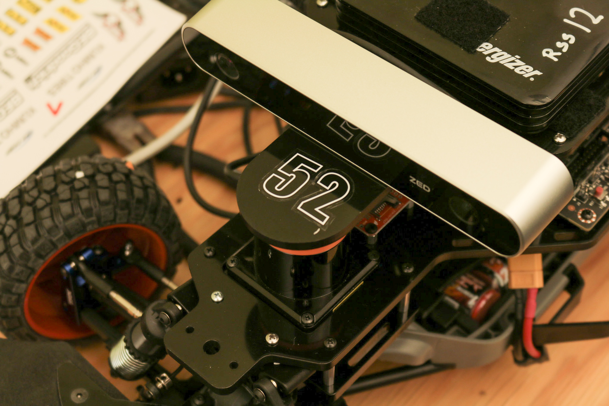
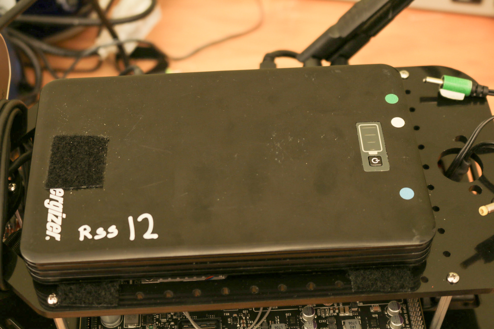
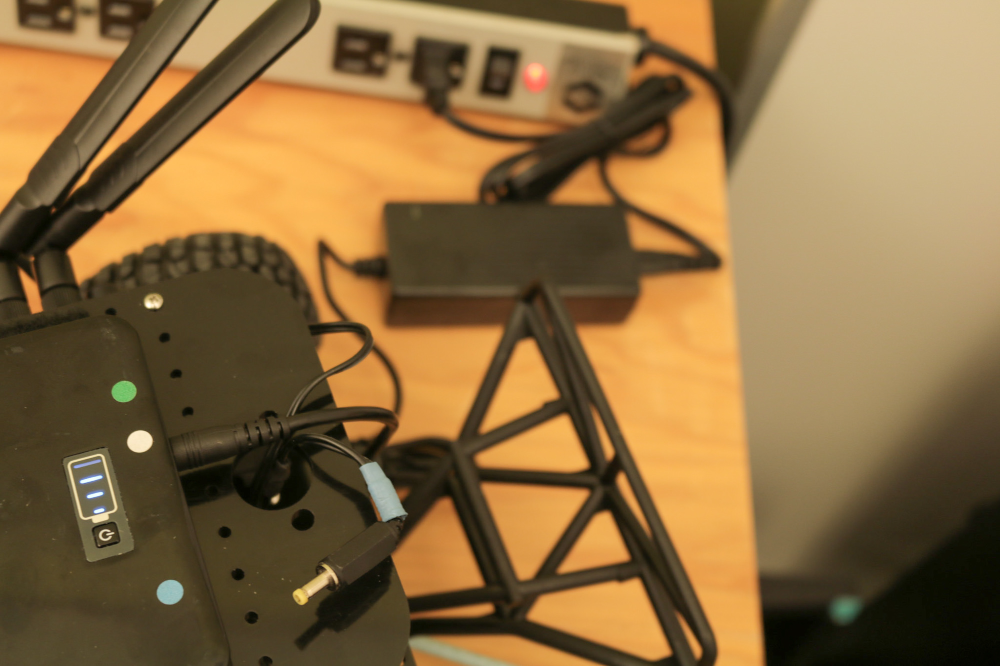
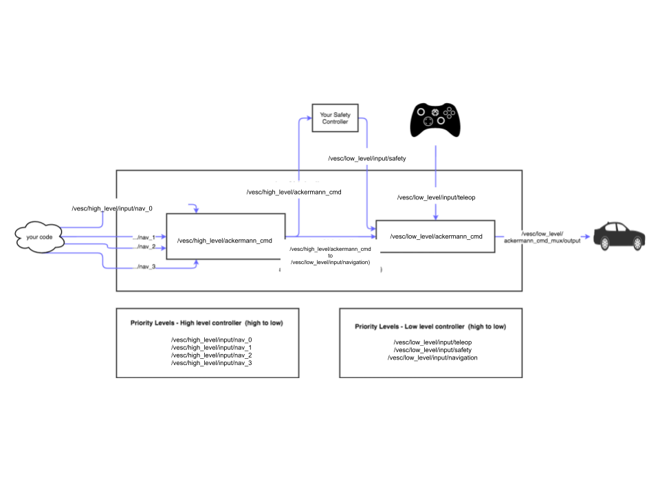
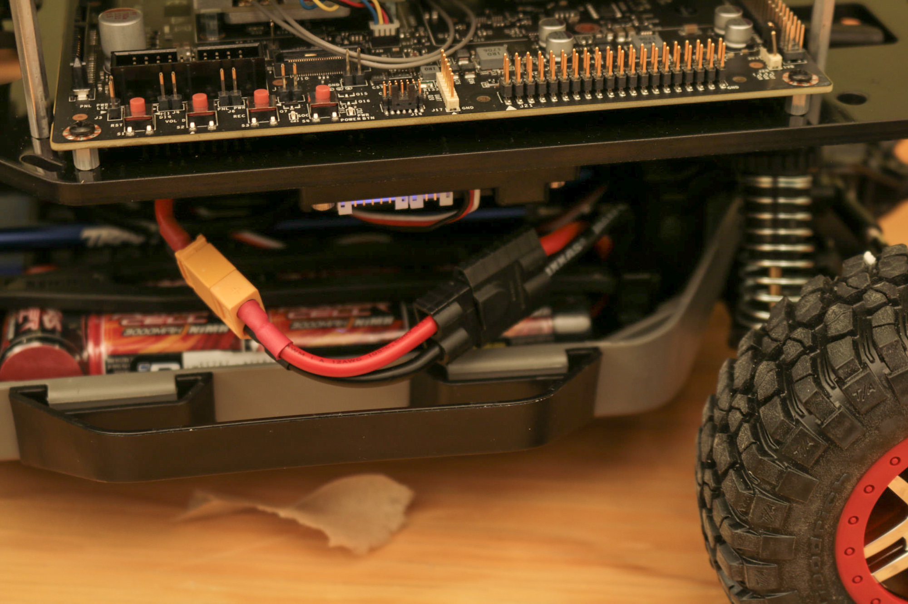
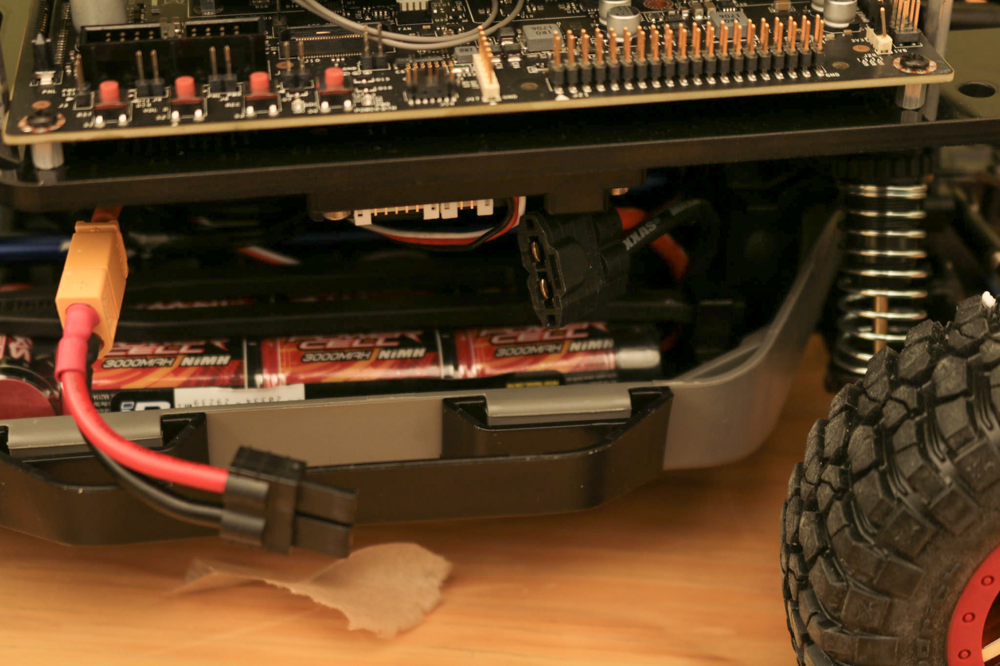
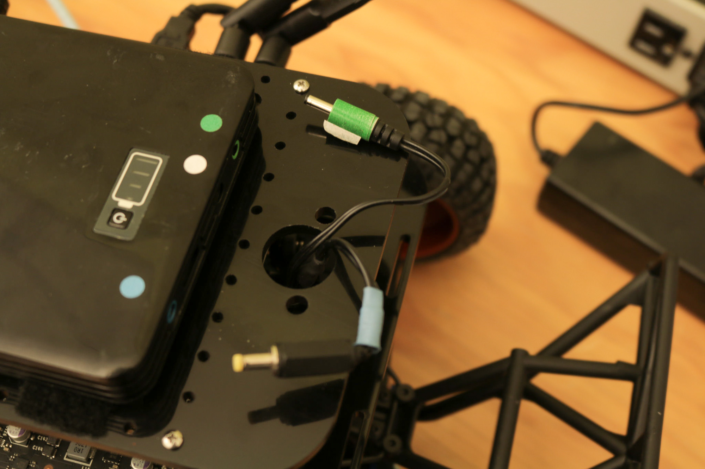

# Lab 3: Wall-Following on the Racecar

| Deliverable                                                                                                                                                | Due Date                             |
|------------------------------------------------------------------------------------------------------------------------------------------------------------|--------------------------------------|
| Briefing Slides (uploaded to your team's website and[canvas](https://canvas.mit.edu/courses/36874/assignments/449541) for grading )                                                           | Monday, March 9th at 1:00PM EST      |
| Briefing (8 min presentation + 3 min Q&A)                                                                                                                   | Monday, March 9th during Lab Hours   |
| Pushed code to Git                                                                                                                                         | Monday, March 9th at 11:59PM EST     |
| TA Checkoff                                                                                                                                                | Wednesday, March 11th at 11:59PM EST |
| Report (2500 word limit*) (on your team's website and [canvas](https://canvas.mit.edu/courses/36874/assignments/449543)) + [Team Member Assessment](https://forms.gle/rjoboMrpYDUpEaGk9) | Friday, March 13th at 11:59PM EST    |

***There will be a 30% penalty applied for exceeding the word limit.**

## [Link to Slides](https://docs.google.com/presentation/d/1o9NIhjz9uiQ_X3LOo1nZf5e4xVVZMneH/edit?usp=sharing&ouid=112086719836319102493&rtpof=true&sd=true)

## Introduction

It's time to use the actual racecar!
In this lab, you will meet your team for the rest of the semester. You will then be selecting and improving the
simulated wall follower code to run on real hardware. Additionally, your team will be required to implement a safety
controller to prevent your racecar from crashing into obstacles (e.g., chairs, tables, people, etc.). You will also be
working on your ability to write high-quality tests, and also data visualization and analysis skills. 

### Racecars

Your team will be assigned a racecar to take care of during the semester. These cars are expensive, so please coordinate
with your team to ensure that someone is always responsible for it and avoid leaving it unattended on campus.

The racecar platform is exciting and fast, but it is not a toy. It is made up of expensive components that should
last for future iterations of the class. It is your responsibility to keep it in good condition. The racecar can survive
a couple light bumps, but if it goes at top speed into a wall it can be destroyed. We understand accidents happen, so
if something comes loose or there are other minor issues, please tell the TAs as soon as possible and we can help fix things.
We expect a few minor issues throughout the semester, as one does when dealing with hardware, so typically it's not a big
deal. However, if you damage the car in an extreme way due to obviously reckless behavior, you may find yourself working on a
simulated car for the rest of the course. 

### Electrical Safety

The racecar components run on relatively low voltages (≤ 20V) and current draw, so we are not too concerned about dangerous shocks.
However, express caution as always when plugging things in, or even touching the board slightly. You should try to ground yourself
before touching the electronic components. 

Additionally, the power banks used to power the car are LiPO batteries, which can be dangerous if not treated properly.
We'll provide storage bags for your team to store them safely when they are not in use. Please review
[these notes](https://ehs.mit.edu/wp-content/uploads/2019/09/Lithium_Battery_Checklist.pdf) for how to operate them safely.
If for some reason they become puffy, let us know IMMEDIATELY so we can deal with it. 

## Submission and Grading

From now on, for each lab, your tasks may include:
- Publishing a report on your team's github pages website, and uploading it to [Canvas](https://canvas.mit.edu/courses/36874/assignments/449543) for grading
- Giving an 8 minute briefing presentation (plus 3 minutes Q&A) together with your team
- Uploading the briefing slides to your github pages website and uploading it to [Canvas](https://canvas.mit.edu/courses/36874/assignments/449541) for grading
- Submitting a team member assessment form
- Completing a check off with your team's assigned TA

See the deliverables chart at the top of this page for due dates and times. You will be uploading your reports and presentations to
both Canvas and a team website that demonstrates your work for the semester. In Part 0 of this lab you'll follow the instructions to
create your website. Beforehand, you'll need to create a Github organization for your team with the name as `rss2026-[TEAM_NUMBER]`.
This is where your code should be pushed to before the lab deadlines.

You can view the rubrics for the [briefing technical grade](https://canvas.mit.edu/courses/36874/assignments/449542), [briefing communication grade](https://canvas.mit.edu/courses/36874/assignments/449541), [report technical grade](https://canvas.mit.edu/courses/36874/assignments/449544), and [report communication grade](https://canvas.mit.edu/courses/36874/assignments/449543) for more details on specific grading criteria. You will receive
a grade out of 10 points for each. Your final lab grade will also be out of 10 points, based on the following weights:

| Deliverable Grade            | Weight |
|------------------------------|--------|
| Briefing grade (out of 10)   | 50%    |
| Lab report grade (out of 10) | 50%    |

This lab is worth 15% of your technical grade, and 10% of your ci grade (with briefing and report being equal weighting as shown)


The capabilities you should demonstrate through your Lab 3 deliverables are:
- Prevent crashes using your safety controller while maintaining flexibility.
- Complete comprehensive quantitative performance testing on your wall following implementation.
- Log into the physical car, manually drive, and visualize a rosbag of the laser scan.
- Autonomously drive the racecar with your wall following code.

Please include video, screenshots, etc. in your lab report as evidence of these deliverables. A good report will make
**quantitative** and **qualitative** evaluations of your results. Ideas and methods for properly displaying any data collected will
be provided at the end of this document, but it is up to your team to decide what is important to include. 

### Check off Instructions

Your pushed code and performance on a mid-lab check-in and a post-lab check off with your team's TA will count toward your **participation grade.**

There will be 1 check-in mid-lab, on Wednesday, March 4th, which gives us an opportunity to make sure your team is on track. There will also be a check-off with your whole team, which can be completed any time from the day of the briefings until the last OH / lab session before the report deadline. For this lab that would be Thursday, March 12th. 

We will come to you for the mid-lab check-in so make sure your whole team is in attendance on mid-lab check-in day. Then, at any point before the check-off deadline, please find your team's assigned TA (or another TA if they are not available) to complete a check-off. It will consist of a few test cases of your controller (both real-world and simulation are fair game), so make sure your code is ready to deploy, ROS parameters are easy to change, etc. Please make sure your entire team is present, as we also want to check everyone's **individual** conceptual and technical understanding. Make sure each teammate knows the inputs/outputs of all the components in the system, and how what each teammate worked on fits into it. 

## Part 0: Team Huddle (Meeting Your Team + Setting Up Website + Setting Up Communication Methods)!

Before beginning the lab, you should get to know your team and prepare your team website and Github organization
(name should be `rss2026-#` where # is your team number). You are going to be working with each other for the rest of the semester,
so please take some time to set up proper communication channels between all of you. This will help with keeping everyone on the
same page about collaborative work times, practicing presentations, etc. :)

Please find your teams for Spring 2026 [here](https://docs.google.com/spreadsheets/d/1x2KxuqEFZz1SCrYEMkkCzOjDmxeGgdn0WIL0jwsYBHg/edit?gid=0#gid=0)!

Each team will be using a Github website in order to organize and publish their reports and briefings. Instructions on how to create this site and organization can be found [here](https://github.com/mit-rss/website2022). 

### Note on Team Charter & Project Management

Each team must create a Team Charter & Project Management document. This document should include agreements about your goals, how
you will communicate and handle the management of your project, as well as an online meeting agenda with space for meeting topics,
decisions and action items, and a detailed timeline with milestones and associated tasks, personnel allocation, start and end time
for tasks, progress status, etc.

- The charter and agenda should be created in a shared online document that is kept up-to-date and shared with the course staff in the
    About section of your online portfolio. Please make sure to give access to this document to the entire RSS staff/TAs. 
- The CI instructors will provide guidance as you develop your Team Charter.
- In addition, we recommend that you create a Google Drive for your car team where you will collect all your project materials.
- There should be an example on canvas linked under 'Team Charter & Project Management' in modules. 
## Part 1: Simulation (Technical Assignment)

### Safety Controller

Now that you’ve got your wall follower working in simulation, we want you to build a safety controller.
In future labs, the racecar will be moving at high speeds, so we need you to build a system that protects it from crashes, and of course,
you are going to build and test it in simulation first!

Please create a new package in `~/racecar_ws/src` for this task. Your goal is to make a node in this package that prevents the
racecar from crashing into obstacles.

*The section on muxes (down below) will help you decide which topic your safety controller should publish to once deployed on the racecar.
Make this topic a ROS parameter so that you can easily change it between the simulation and the racecar.*

On the racecar, we will want you to be able to demonstrate that your safety controller is robust. You should be able to attempt to
crash the racecar in a variety of scenarios and have the safety controller prevent the crashes. You should also be able to walk in
front of the racecar without it running into you. 

At the same time, your racecar should not be "scared". You should still be able to drive close to walls, turn around corners, go fast,
etc., without the racecar freezing in its tracks. You will be required to run your safety controller in all future labs, so don't
cripple yourself with something overprotective. There are trade-offs you will face, and you should ideally record any findings on how you arrived
at your final design. 

### Wall Follower

Last week, each member of your team designed their own version of a wall-following algorithm for the racecar simulator. However,
you only get one racecar per team. This means that your team will need to work together to combine ideas from multiple implementations
of the wall follower to make a single, more robust controller.

> **Note:** PID controllers are not one-size-fits-all. You may find that different parameter tunings, controller implementations,
> and special cases work best for different racecar speeds and racetrack conditions.

While developing and iterating on your combined algorithm, consider how you can accurately gauge its performance,
especially when comparing two different implementations or parameter tunings. Include a qualitative **and** quantitative discussion
on this and how you settled on your final wall following algorithm in your team's briefing and report. We recommend creating visuals
to help support your conclusion!

Questions to help with evaluating your wall follower:
- How do you know when your wall follower is performing well?
- What data can you collect to quantitatively evaluate wall-following performance?
- What metrics are you using as part of your evaluation?
- How many repeated tests are you using?
- How do you ensure repeatability?  
- What racing conditions (especially racecar speeds and racecar paths) should you test on to best determine performance?
- What graphs/visuals can you create to help make evaluation easier?

## Part 2: Getting Started with the RACECAR Platform!

### What's in your RACECAR bin? (Hardware)

Before making any connections, ensure that your bin has the following items:
- racecar platform 
- logitech controller (looks like an xbox game controller)
- wifi router
- wifi router power supply (should be labeled)
- portable battery (one of two types, both should be rectangular)
- portable battery charger 
- red brick
- ethernet cable
- nimh motor battery (looks like a bunch of small batteries stuck together with a red and black cable connector sticking out)

Once you have your car, search for its number. You can find it in two places; on top of the car's lidar and the top of your router. The car's number will be in block letter stickers. If you have an older car or router there might be other numbers written or labeled on it that you can ignore.



Plug your router into an outlet in your team's power strip. Make sure you are using the **12V power supply** that says "TP-Link" on it. **Using the other power supply / charger will fry your router**. 


Check the battery status on your racecar by pressing the power button on your car's primary battery.
This may be the black energizer pictured below or the grey [XTPower](https://www.amazon.com/dp/B07JJTYH8F) battery.
On the hokuyo cars, the battery sits right on top of the car.

When powered on, these batteries will remain on until power stops being drawn from them, so please remember to unplug your power cables when the car is not in use.



If your battery is low, charge it with the 18V adapter. 
Do not charge your battery while it is plugged in to the jetson (board).   
Please remember to charge your batteries when you are not working on the cars. 

The battery lasts a surprisingly long time; so as long as you keep the battery charged when you are not working, it can last the entire lab. Remember to unplug it before putting your robot away.



Charge your motor battery by plugging it into the charger that looks like a blue block.
Hold the start button for 2 seconds to charge - you should hear the battery fans begin to spin.
This battery won't last as long, especially when you are going fast, so remember to charge it when the car is not moving. The jetson will not be affected if the motor battery gets unplugged.


### Connecting To RACECAR

#### Network Setup

Now that you have found your RACECAR's number and your router has been plugged in, you are ready to start connecting to the RACECAR.

Your router will not be connected to the internet unless you plug in the ethernet into an ethernet port (in the wall/table).

From your laptop, please connect to one of these two wifi networks. When prompted, you should enter the password `g0tRACECAR?`

```
RACECAR_AP_[YOUR_CAR_NUMBER]
RACECAR_AP_[YOUR_CAR_NUMBER]_5GHz
```

The 5GHz network provides a faster connection but has a more limited range. You can access the racecar without the
router being connected to the internet.

**NOTE: On the router, plug the ethernet cable into the BLUE slot, NOT the ORANGE. Otherwise, there will be networking issues.**

#### SSHing into RACECAR

To connect to the racecar from your local machine, please ensure you are connected to the correct network and then run this command:

```
ssh racecar@192.168.1.YOUR_CAR_NUMBER
```

The password is `racecar@mit`. 

Now that you are connected, take a few minutes to read through the next part to understand how the software inside the car works. 

### Exploring the RACECAR Software Stack (Software Guide + Mux Guide + Software Setup)

It should be familiar, but poke around to get comfortable with the structure.
Just like in the simulator, you will often need multiple terminal windows open in order to launch different ROS nodes.
Here are some ways to do this:

- Open multiple windows on your local machine and `ssh racecar` in each one of them. You can even ssh from multiple computers
    at the same time, but make sure you are communicating with your team members if you do this.
- Use [tmux](https://github.com/tmux/tmux/wiki) or [screen](https://kb.iu.edu/d/acuy) to open layered windows in a terminal and
    navigate through them with key commands.

#### Start Your Engines! (RACECAR Start-up)

- SSH into the racecar
- Start the car's Docker container using the startup script:
    - `cd && ./run_rostorch.sh`.
    - **This should be done exactly once every restart to access the Docker container! To connect to the container from a
        different terminal, use `connect`.**
    - We recommend doing `./run_rostorch.sh` within a `tmux` session, since if this session dies, all of your connected terminals will close.
- Git clone one of your team member's wall following code from lab 2 into your local directory `~/racecar_ws/src/[WALL_FOLLOWER_CODE]`.
    We highly recommend setting up your SSH keys on your robot (as you did in Lab 1A) so you can push/pull code from your robot!
- Now you have all your code on the racecar! Have fun!
- You can also use the 'scp' linux command to transfer files from your local computer to the racecar's computer and vice versa. 
#### RACECAR directory layout

The RACECAR comes preinstalled with most of the software you will need throughout the course. We highly recommend you keep your own software organized on the car. It's possible your car will need to be reflashed or swapped throughout the course, so it would be good if you could easily restore your code. If you want to install packages/`sudo apt-get update`/`sudo apt-get upgrade`, remember that you have to be connected to the internet.

```bash
~/racecar_ws # This is where you should put your ROS modules on the car (alongside the base directory).
~/ros2_ws  # This workspace contains all base code for the car (it makes `teleop` work properly). In general you should not modify this without TA support. 
```

### Muxes

Unlike the simulation (in which you just publish to the `/drive` topic), the racecar has a command mux with different levels of priority
that you will need in building your controllers.



The navigation topic you have been publishing to is an alias for the highest priority navigation topic in the mux:

```
/vesc/input/navigation -> /vesc/high_level/input/nav_0
```

For brevity, we will refer to `/vesc/high_level/input/nav_i` as `.../nav_i` in this handout (*this doesn't work on the actual racecar*).
Driving commands sent to `.../nav_0` override driving commands sent to `.../nav_1`, `.../nav_2`, etc.
Likewise, driving commands sent to `.../nav_1` override driving commands sent to `.../nav_2`, `.../nav_3`, etc.
You can use this structure to layer levels of control.

For example, a robot whose job is to explore randomly and collect minerals as it finds them could use 2 muxes.
The controller that explores randomly could publish to a lower priority topic like `.../nav_1`.
Whenever the vision system detects minerals, it could begin to publish commands to a higher priority topic like
`.../nav_0`. `.../nav_0` would override `.../nav_1` until the minerals have been depleted and commands stopped being
published to `.../nav_0`.

The navigation command with the highest priority is then published to `/vesc/high_level/ackermann_cmd`.
This topic is then piped to `/vesc/low_level/input/navigation` and fed into another mux with the following priorities (from highest to lowest):

```
/vesc/low_level/input/teleop
/vesc/low_level/input/safety
/vesc/low_level/input/navigation
```

`.../teleop` is the topic that the joystick publishes to.
This will always have the highest priority. `.../safety` has the next highest priority. It will override anything published
to `.../navigation`. This is where your safety controller will publish.

So for your safety controller, this means:

- Subscribe to `/vesc/low_level/ackermann_cmd` to intercept the driving command that is being published.
- Subscribe to sensors like `/scan`.
- Publish to `/vesc/low_level/input/safety` if the command being published to the navigation topic is in danger of crashing the racecar.

**Note: These topics only exist on the physical racecar, not the simulation.** This means your simulated safety controller will
not be able to send stop commands at a higher priority than driving commands when using the simulator. 

For this section, feel free to just make the scaffold of a speed controller that publishes a 0 velocity `/drive`
AckermannDriveStamped message to your simulated racecar whenever it reaches a situation that you think it should stop in.
Test your simulated safety controller by launching the racecar simulator and issuing some singular test drive commands that
drive the racecar in the direction of an obstacle.  

During Part 4, you will switch this drive topic using ROS parameters to make use of the muxes described above, put your code on
the actual racecar, and tune your algorithm to better work in real-life situations.

## Part 3: RACECAR's First Lap! Let's get your car moving!

### Manual Navigation

When you are ready, plug the cable connected to the portable battery into the Jetson. A visual is provided below.



The Jetson should automatically turn on after being provided power. It may take at least 10 seconds before you are able to ssh into it. 

Place the car on your red brick so its wheels do not touch the ground and are free to spin.

On ONE terminal, run the following command to start up the Docker container. This is similar to `docker compose up` on your computer:

```
cd && ./run_rostorch.sh
```

Then, on a **new terminal**, run `connect` to enter your Docker container. This is similar to `docker compose exec racecar bash`.

Finally, launch this command in the terminal to start up the robot (it's an alias referencing a launch file):

```
teleop
```

Note that if you JUST plugged in the motor battery, it takes a few seconds for the VESC motor controller to be recognized,
so if you run teleop, and get the error `Failed to connect to the VESC`, wait a few seconds, and try running the command again.

Now you should be able to move the car around with the joystick! To control the car manually with the controller,
**you need to press and hold the left bumper (LB)** while you use the left joystick to move forward or back and the right joystick
to steer left or right.

`teleop` also acts as a [dead man's switch](https://en.wikipedia.org/wiki/Dead_man%27s_switch) and it is an easy way to stop the car
from crashing - just let go of the trigger. 

### Autonomous Navigation Intro

While running any of your code, you will need to hold down the dead man's switch. **For the dead man's switch, hold down the right bumper (RB)**.
Once holding the dead man's switch, your code should run. 

#### Debugging: The car isn't moving!

- Make sure the joystick is connected and in the right mode by running `ros2 topic echo /vesc/joy`. When you press buttons on the
    joystick, you should see the messages on this topic update.
    - The green light (next to the word mode) on the controller should be off. If it is on, press the mode button to change it back. 
- Are you pressing and holding the left bumper on the joystick?
- Make sure the motor battery is plugged in and charged.
- Make sure the lidar is turned on and connected.

## Part 4: IRL Safety Controller and Wall Following (The Technical Assignment)

### Cleaning Up Procedure 

Before you get too far ahead, remember that when you are done using the racecar, you **must unplug all power cables**.
This includes 2 cables that connect to the XTPower battery and the motor battery. Not doing this can destroy the batteries and the servo.




### Safety Controller

Now that you have your racecar, use `scp` or `git` to get your team's safety controller onto the car. The safety controller
should live in the `src` folder of your workspace, `~/racecar_ws/src/[WALL_FOLLOWER_CODE]`. **Remember to** `colcon build` in
the root of your workspace to rebuild it and then `source ~/racecar_ws/install/setup.bash`.

Test the performance of your safety controller by updating the necessary parameters (see the
[muxes section](https://github.com/mit-rss/wall_follower#muxes) for more details) and launching the node.
You should engage the safety controller in a variety of conditions to ensure that the controller is robust and adheres to
the description provided in **Part 1**.

**Please be careful when you are testing**. Always have your joystick ready to stop the racecar and start very slowly. 

### Wall Following

Just as you did for the safety controller, get your team's updated wall following code onto the car. **Remember to**
`colcon build` in the root of your workspace on the car to rebuild it and then `source ~/racecar_ws/install/setup.bash`.

You will already find a `wall_follower` package on the car that provides a simple example of how to execute driving commands.
The node executable is called `example`. You may use this if you wish. See the [muxes section](https://github.com/mit-rss/wall_follower#muxes)
for more details on the different topics. 

Get the car into a safe location and make sure `teleop` is running. In another terminal, launch

```
ros2 launch wall_follower wall_follower.launch.xml
```
    
To activate the wall follower, hold down the right bumper on the joystick (dead man's switch).

**As necessary, tune the parameters in the wall follower so that it works well in the real world.**

Notice that we have not defined above what "it works well in the real world" means. In both your Lab 3 briefing and in your final
report on Lab 3, we will be grading you on how you evaluate your own performance. Although a video of your car cruising alongside
a wall is nice to look at (and good visual evidence!), we want to see statistics of metrics from repeated runs. For example,
if you decide that cross-track error is a good metric, we are going to want to see a statistical analysis of that error. 

Consider why performance on the robot might differ from performance in the simulator and what techniques you can use to improve
your controller in deployment. Your final report on Lab 3 should briefly address these topics and include at least one evaluation
metric that gives a comparison of performance between simulation and real-world performance. 

You should also consider a test harness that allows you to repeatedly evaluate performance of your car. The controller you develop
in this lab may be useful in future labs. Test harnesses that assess metrics will allow you in future labs to know if you have
accidentally changed anything that has caused a regression in performance. 

## Data Visualization, Recording, and Analysis 

### RViz

You can connect to RViz by connecting to your car's display. We have set this up for you as a vncserver accessible on port 6081
(your local `racecar_docker` is on 6080). This is hosted on the car. 

To access this on your local machine, you need to forward port 6081. This can be done by running:

```
ssh -L 6081:localhost:6081 racecar@192.168.1.[CAR_NUMBER]
```

This ssh command only needs to be done once on your machine, and can be run either inside or outside of your `racecar_docker` image.
If you notice the connection breaks, check to see whether this session died. 

Then, you can navigate to the link

http://localhost:6081/vnc.html?resize=remote

to view the display. 

**Note:** There is only one shared display at the moment, so only one person can control the window at a time. 

Try to see if you can visualize laser scans. To do that, open up the terminal by clicking on the left bottom button,
selecting `System Tools`, and then selecting the last option, `Xterm`. Then, type `rviz2`. Add a LaserScan message by
topic to subscribe to `/scan`, and change the fixed frame to `/laser`. You can change the size of the points in the dropdown
if they are hard to see. 

### Recording a Rosbag

[rosbag](https://docs.ros.org/en/humble/Tutorials/Beginner-CLI-Tools/Recording-And-Playing-Back-Data/Recording-And-Playing-Back-Data.html)
will be your invaluable friend this year for compiling lab reports, especially as we move to the final challenge and will have limited time
at the Johnson Track, where it will be held.

In [Lab 1C](https://github.com/mit-rss/intro_to_ros), you recorded bagfiles from the racecar simulator and inspected bagfiles recorded
from the real racecar. Make sure you are comfortable with recording bagfiles on your racecar, transferring them to your local
machine (try `scp`), and playing them back to analyze the data.

